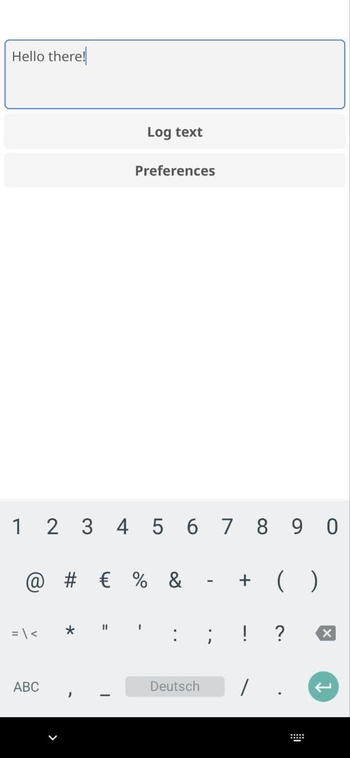
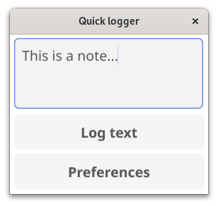

# Quick logger


This is a tiny GUI app written in Go using the Fyne framework to quickly log a message to a file. Read on my blog more about this: https://foo.zone/gemfeed/2024-03-03-a-fine-fyne-android-app-for-quickly-logging-ideas-programmed-in-golang.html

The purpose of this is to have a small Android app to quickly log Ideas into a folder as plain text files.  From there, Syncthing will sync it to my computer at home. 

This are screenshots of the App running on Android and Fedora Linux.




## Build and Run (Mage)

This repo includes Mage tasks to build, run and cross‑compile.

Install Mage:

```sh
go install github.com/magefile/mage@latest
```

Clone and enter the repo:

```sh
git clone https://codeberg.org/snonux/quicklogger
cd quicklogger
```

Common tasks:

```sh
# Build desktop binary into ./bin
mage build

# Run the app (shows verbose Go build output)
mage run

# Clean build artifacts
mage clean
```

## Android Builds

Two options exist: local Fyne packaging or containerized cross‑compile.

- Local packaging (requires Fyne CLI and Android NDK):

  ```sh
  # Install Fyne CLI if needed
  go install fyne.io/fyne/v2/cmd/fyne@latest

  # Ensure ANDROID_NDK_HOME points to your NDK (e.g. ~/android-ndk/android-ndk-r26b)
  export ANDROID_NDK_HOME=~/android-ndk/android-ndk-r26b

  # Build APK in the project root as quicklogger.apk
  mage android
  ```

- Containerized cross‑compile (recommended, uses fyne-cross with Docker/Podman):

  ```sh
  # Start Podman if you prefer Podman over Docker
  sudo systemctl start podman

  # The task auto-detects a user Podman socket; otherwise it uses Docker defaults
  mage androidcross
  ```

After cross‑compiling, the APK is located at `fyne-cross/dist/android/quicklogger.apk`.
Copy it to your device and install it (you may need to allow installing from unknown sources):

```sh
adb install -r fyne-cross/dist/android/quicklogger.apk
# or copy manually and install on device
```
