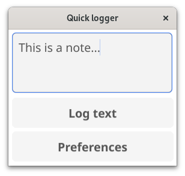

# Quick logger

> **Deprecation notice:** This app is **deprecated and no longer maintained.**
> Please use [Quicklog](https://github.com/snonux/quicklog) instead.
>
> The reason is that Fyne (the UI toolkit used here) has notable limitations on
> Android that make features like receiving shared text and keyboard
> auto-suggestions awkward to support without fragile APK post-processing
> (see [`docs/`](docs/)). The successor, Quicklog, avoids these Fyne-on-Android
> limitations.


This is a tiny GUI app written in Go using the Fyne framework to quickly log a message to a file. Read on my blog more about this: https://foo.zone/gemfeed/2024-03-03-a-fine-fyne-android-app-for-quickly-logging-ideas-programmed-in-golang.html

The purpose of this is to have a small Android app to quickly log Ideas into a folder as plain text files.  From there, Syncthing will sync it to my computer at home. 

This are screenshots of the App running on Android and Fedora Linux.




## Build and Run (Mage)

This repo includes Mage tasks to build, run and cross‑compile.

Install Mage:

```sh
go install github.com/magefile/mage@latest
```

Clone and enter the repo:

```sh
git clone https://codeberg.org/snonux/quicklogger
cd quicklogger
```

Common tasks:

```sh
# Build desktop binary into ./bin
mage build

# Run the app (shows verbose Go build output)
mage run

# Clean build artifacts
mage clean
```

## Android Builds

Two options exist: local Fyne packaging or containerized cross‑compile.

- Local packaging (requires Fyne CLI and Android NDK):

  ```sh
  # Install Fyne CLI if needed
  go install fyne.io/fyne/v2/cmd/fyne@latest

  # Ensure ANDROID_NDK_HOME points to your NDK (e.g. ~/android-ndk/android-ndk-r26b)
  export ANDROID_NDK_HOME=~/android-ndk/android-ndk-r26b

  # Build APK in the project root as quicklogger.apk
  mage android
  ```

- Containerized cross‑compile (recommended, uses fyne-cross with Docker/Podman):

  ```sh
  # Start Podman if you prefer Podman over Docker
  sudo systemctl start podman

  # The task auto-detects a user Podman socket; otherwise it uses Docker defaults
  mage androidcross
  ```

After cross‑compiling, the APK is located at `fyne-cross/dist/android/quicklogger.apk`.
Copy it to your device and install it (you may need to allow installing from unknown sources):

```sh
adb install -r fyne-cross/dist/android/quicklogger.apk
# or copy manually and install on device
```

## Share with QuickLogger on Android

Fyne's build does not compile custom Java into the APK (its `classes.dex` is a
pre-baked blob), and the main `GoNativeActivity` does not read `ACTION_SEND`
intents. So share support is added by post-processing the built APK with a small
`ShareActivity` that hands the shared text to the app via a cache file.

The one-command build is `mage androidshare`, which builds the base APK via
`androidcross` and then runs `scripts/patch-apk.sh` to merge in `ShareActivity`,
add a `SEND` intent-filter to the manifest, and re-sign:

```sh
mage androidshare
# Output: fyne-cross/dist/android/quicklogger-share.apk
```

IME suggestions (e.g. FUTO keyboard) are enabled by default — a partial fix
(see caveats below). To disable them, set `SUGGESTIONS=0`:

```sh
SUGGESTIONS=0 mage androidshare
```

> Note: enabling IME suggestions is partial — see
> [`docs/android-keyboard.md`](docs/android-keyboard.md) for why.
>
> If installing over an older build signed with a different key, uninstall first:
> `adb uninstall org.buetow.quicklogger` (see [`docs/grapheneos-setup.md`](docs/grapheneos-setup.md)).

To use it: from any app that can share text, choose **Share → QuickLogger**.
The text opens in the editor to review/edit, then tap **Log text**. Enable
**Preferences → Auto-log shared text** to skip the editor and save shared text
directly to your log directory.

## Documentation

- [`docs/android-share.md`](docs/android-share.md) — why share needs APK
  post-processing and how `scripts/patch-apk.sh` works.
- [`docs/android-keyboard.md`](docs/android-keyboard.md) — the FUTO/IME
  suggestions fix and its limits.
- [`docs/grapheneos-setup.md`](docs/grapheneos-setup.md) — storage scopes and
  the "read-only filesystem" error.
- [`docs/build-notes.md`](docs/build-notes.md) — `.gitignore`, build number, and
  signing-key notes.
